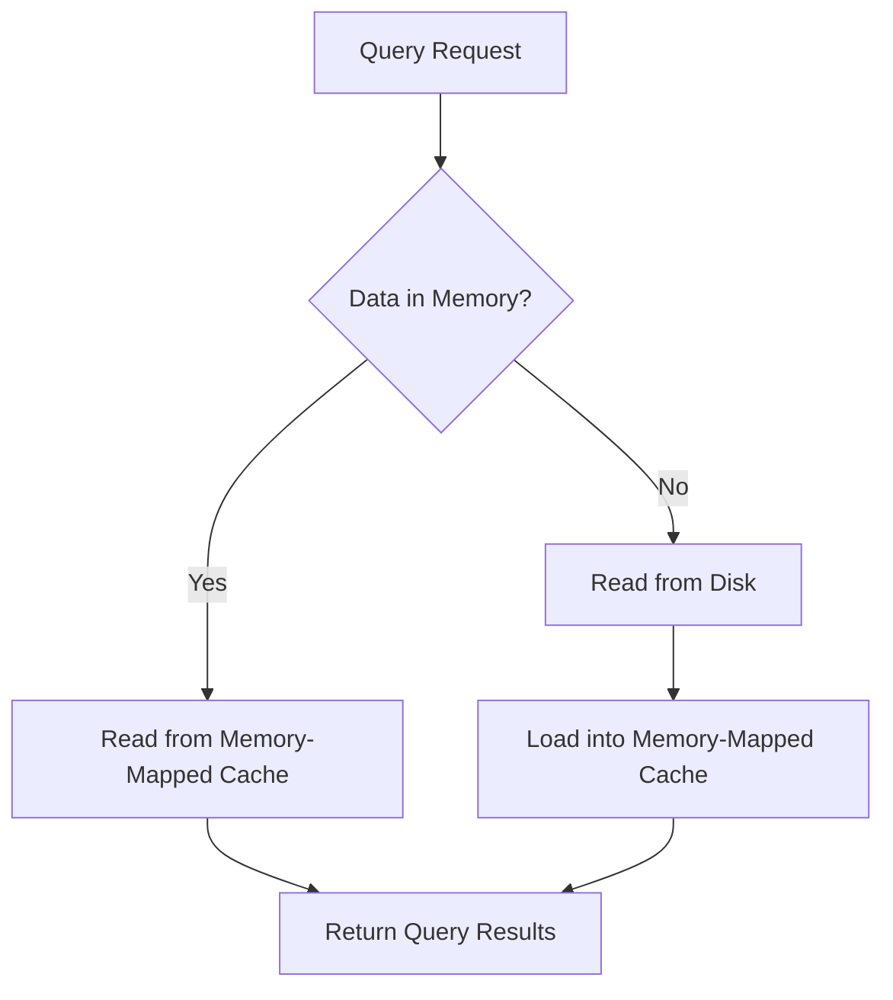

The **Historical service** is responsible for storing and querying historical data. Historical services cache data segments on local disk and serve queries from that cache as well as from an in-memory cache.

## Key Responsibilities

<CardGroup cols={2}>
  <Card title="Segment Storage" icon="hard-drive">
    Caches data segments on local disk in the segment cache
  </Card>
  <Card title="Query Execution" icon="magnifying-glass">
    Serves queries from local disk cache and memory-mapped cache
  </Card>
  <Card title="Segment Loading" icon="download">
    Pulls segment files from deep storage to local disk
  </Card>
  <Card title="ZooKeeper Integration" icon="sitemap">
    Monitors ZooKeeper for segment assignment and announces segment availability
  </Card>
</CardGroup>

## Configuration

For Apache Druid Historical service configuration, see:
- [Historical Configuration](/configuration/historical)
- [Basic cluster tuning](/operations/basic-cluster-tuning#historical)

## Running the Historical

```bash
org.apache.druid.cli.Main server historical
```

## Loading and Serving Segments

Each Historical service copies or pulls segment files from deep storage to local disk in an area called the **segment cache**.

<Note>
To configure the size and location of the segment cache on each Historical service, set the `druid.segmentCache.locations` property. For more information, see [Segment cache size](/operations/basic-cluster-tuning#segment-cache-size).
</Note>

### How Segment Assignment Works

<Steps>
  <Step title="Coordinator creates ZooKeeper entry">
    The Coordinator controls the assignment of segments to Historicals and the balance of segments between Historicals. The Coordinator creates ephemeral entries in ZooKeeper in a load queue path.
  </Step>
  <Step title="Historical monitors ZooKeeper">
    Each Historical service maintains a connection to ZooKeeper, watching those paths for segment information.
  </Step>
  <Step title="Historical checks segment cache">
    When a Historical service detects a new entry in the ZooKeeper load queue, it checks its own segment cache.
  </Step>
  <Step title="Retrieve segment metadata">
    If no information about the segment exists in the cache, the Historical service first retrieves metadata from ZooKeeper about the segment, including where the segment is located in deep storage and how it needs to decompress and process it.
  </Step>
  <Step title="Pull from deep storage">
    The Historical pulls down and processes the segment from deep storage.
  </Step>
  <Step title="Announce availability">
    After processing the segment, Druid advertises the segment as being available for queries from the Broker. This announcement is made via ZooKeeper, in a served segments path.
  </Step>
</Steps>

<Info>
**Historical services do not communicate directly with each other**, nor do they communicate directly with the Coordinator. All coordination happens through ZooKeeper.
</Info>

<Tip>
To make data from the segment cache available for querying as soon as possible, Historical services search the local segment cache upon startup and advertise the segments found there.
</Tip>

## Loading and Serving Segments from Cache

The segment cache uses **memory mapping (mmap)**. The cache consumes memory from the underlying operating system so Historicals can hold parts of segment files in memory to increase query performance at the data level.

### Memory-Mapped Cache Behavior

The in-memory segment cache is affected by:
- Size of the Historical JVM
- Heap / direct memory buffers
- Other services on the operating system itself

<Tabs>
  <Tab title="Data in Memory">
    At query time, if the required part of a segment file is available in the memory mapped cache or "page cache", the Historical **re-uses it and reads it directly from memory**.
    
    <Info>
    If free operating system memory is close to `druid.server.maxSize`, segment data is more likely to be available in memory and reduce query times.
    </Info>
  </Tab>
  <Tab title="Data on Disk">
    If the required data is not in the memory-mapped cache, the Historical **reads that part of the segment from disk**.
    
    <Warning>
    There is potential for new data to flush other segment data from memory. The lower the free operating system memory, the more likely a Historical is to read segments from disk.
    </Warning>
  </Tab>
</Tabs>

### Understanding Cache Layers



<Note>
This memory-mapped segment cache is **in addition to** other query-level caches. For more information, see [Query Caching](/querying/caching).
</Note>

## Querying Segments

You can configure a Historical service to log and report metrics for every query it services.

<Card title="Query Documentation" icon="book" href="/querying/querying">
  For information on querying Historical services, see the Querying documentation.
</Card>

## HTTP Endpoints

For a list of API endpoints supported by the Historical, see:
- [Service status API reference](/api-reference/service-status-api#historical)

## Architecture Integration

<CardGroup cols={2}>
  <Card title="With Coordinator" icon="server">
    - Receives segment assignment instructions via ZooKeeper
    - Does not communicate directly
    - Coordinator manages which segments to load/drop
  </Card>
  <Card title="With Broker" icon="route">
    - Announces segment availability via ZooKeeper
    - Receives and executes queries from Broker
    - Returns query results to Broker for consolidation
  </Card>
  <Card title="With ZooKeeper" icon="sitemap">
    - Monitors load queue path for new segment assignments
    - Announces served segments in served segments path
    - Retrieves segment metadata
  </Card>
  <Card title="With Deep Storage" icon="box-archive">
    - Pulls segment files from deep storage
    - Caches segments locally on disk
    - Decompresses and processes segment files
  </Card>
</CardGroup>

## Performance Considerations

<Tip>
To optimize Historical service performance:

1. **Size segment cache appropriately**: Ensure `druid.segmentCache.locations` has enough space for your working set of segments
2. **Maximize free OS memory**: More free memory means more data in the memory-mapped cache
3. **Use SSDs for segment cache**: Fast disk I/O improves cold query performance
4. **Monitor cache hit rates**: Track how often queries hit memory vs. disk
5. **Configure appropriate replication**: Balance query performance with storage costs
</Tip>

<Warning>
**Segment Cache vs. Heap Memory**

The segment cache is separate from JVM heap memory. It uses OS-level memory mapping, so you need to consider:
- JVM heap size
- Direct memory buffers
- OS page cache size
- Total available RAM

Ensure your system has enough RAM for all these components.
</Warning>