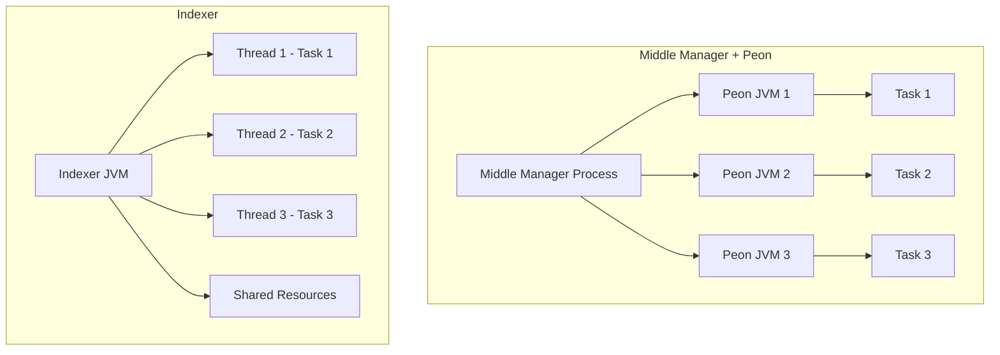

<Warning>
The Indexer is an **optional and experimental feature**. If you're primarily performing batch ingestion, we recommend you use either the MiddleManager and Peon task execution system or MiddleManager-less ingestion using Kubernetes. If you're primarily doing streaming ingestion, you may want to try either MiddleManager-less ingestion using Kubernetes or the Indexer service.
</Warning>

The Apache Druid **Indexer service** is an alternative to the Middle Manager + Peon task execution system. Instead of forking a separate JVM process per-task, the Indexer runs tasks as **separate threads within a single JVM process**.

## Key Differences from Middle Manager + Peon

<CardGroup cols={2}>
  <Card title="Execution Model" icon="microchip">
    **Indexer**: Tasks run as threads in a single JVM
    
    **Middle Manager**: Tasks run in separate JVM processes (Peons)
  </Card>
  <Card title="Resource Sharing" icon="share-nodes">
    **Indexer**: Better resource sharing across tasks (query processing, HTTP threads, memory)
    
    **Middle Manager**: Complete isolation between tasks
  </Card>
  <Card title="Configuration" icon="sliders">
    **Indexer**: Easier to configure and deploy
    
    **Middle Manager**: More configuration parameters for Peon processes
  </Card>
  <Card title="Overhead" icon="weight-hanging">
    **Indexer**: Lower per-task overhead (no JVM startup, shared resources)
    
    **Middle Manager**: Higher overhead but better isolation
  </Card>
</CardGroup>

## When to Use the Indexer

The Indexer is designed to be easier to configure and deploy compared to the Middle Manager + Peon system and to better enable resource sharing across tasks.

<Tabs>
  <Tab title="Good Use Cases">
    <Check>**Streaming ingestion workloads** with many concurrent tasks</Check>
    <Check>**Resource-constrained environments** where JVM overhead matters</Check>
    <Check>**Simplified deployments** where ease of configuration is important</Check>
    <Check>**Workloads with predictable resource usage** across tasks</Check>
  </Tab>
  <Tab title="Consider Alternatives">
    <Warning>**Batch ingestion as primary workload** - Use Middle Manager + Peon or Kubernetes-based ingestion</Warning>
    <Warning>**Tasks with highly variable resource requirements** - Isolation may be beneficial</Warning>
    <Warning>**Production-critical workloads** - The Indexer is still experimental</Warning>
    <Warning>**Need for separate task logs** - Currently not supported in the Indexer</Warning>
  </Tab>
</Tabs>

## Configuration

For Apache Druid Indexer service configuration, see:
- [Indexer Configuration](/configuration/indexer)

## Running the Indexer

```bash
org.apache.druid.cli.Main server indexer
```

## HTTP Endpoints

The Indexer service shares the same HTTP endpoints as the Middle Manager:
- [Middle Manager API reference](/api-reference/service-status-api#middle-manager)

## Task Resource Sharing

The following resources are shared across all tasks running inside the Indexer service:

### Query Resources

<Info>
The query processing threads and buffers are shared across all tasks. The Indexer serves queries from a **single endpoint shared by all tasks**.
</Info>

If query caching is enabled, the query cache is also shared across all tasks.

<Note>
This shared query infrastructure can improve overall efficiency but means that query load from one task can affect others.
</Note>

### Server HTTP Threads

The Indexer maintains **two equally sized pools of HTTP threads**:

<Steps>
  <Step title="Chat handler thread pool">
    Exclusively used for task control messages between the Overlord and the Indexer
  </Step>
  <Step title="General HTTP thread pool">
    Used for handling all other HTTP requests (queries, status, etc.)
  </Step>
</Steps>

<ParamField path="druid.server.http.numThreads" type="integer">
  Configures the size of each pool. For example, if set to 10, there will be:
  - 10 chat handler threads
  - 10 non-chat handler threads
  - 2 additional threads for lookup handling (if lookups are used)
</ParamField>

### Memory Sharing

The Indexer uses a **global heap limit** across all tasks, which is then divided among individual tasks.

<ParamField path="druid.worker.globalIngestionHeapLimitBytes" type="bytes">
  Imposes a global heap limit across all tasks running in the Indexer.
  
  **Default**: 1/6th of the available JVM heap
  
  This global limit is evenly divided across the number of task slots configured by `druid.worker.capacity`.
</ParamField>

<Warning>
**Important Memory Behavior**

To apply the per-task heap limit, the Indexer **overrides** `maxBytesInMemory` in task tuning configurations:
- Ignores the default value
- Ignores any user-configured value
- Also overrides `maxRowsInMemory` to an essentially unlimited value (the Indexer does not support row limits)
</Warning>

### Understanding Peak Memory Usage

The peak usage for rows held in heap memory relates to the interaction between `maxBytesInMemory` and `maxPendingPersists`:

<Steps>
  <Step title="Ingestion fills buffer">
    When the amount of row data held in-heap by a task reaches the limit specified by `maxBytesInMemory`, the task will persist the in-heap row data.
  </Step>
  <Step title="Concurrent ingestion continues">
    After the persist has been started, the task can again ingest up to `maxBytesInMemory` bytes worth of row data while the persist is running.
  </Step>
  <Step title="Peak memory calculation">
    This means that the peak in-heap usage for row data can be up to approximately:
    
    ```
    maxBytesInMemory * (2 + maxPendingPersists)
    ```
    
    <Note>
    The default value of `maxPendingPersists` is 0, which allows for 1 persist to run concurrently with ingestion work.
    </Note>
  </Step>
</Steps>

<Info>
The remaining portion of the heap is reserved for:
- Query processing
- Segment persist/merge operations
- Miscellaneous heap usage
</Info>

### Concurrent Segment Persist/Merge Limits

To help reduce peak memory usage, the Indexer imposes a limit on the number of concurrent segment persist/merge operations across all running tasks.

<ParamField path="druid.worker.numConcurrentMerges" type="integer">
  Limits the number of concurrent persist/merge operations.
  
  **Default**: `(druid.worker.capacity / 2)`, rounded down
</ParamField>

<Tip>
This limit helps prevent memory spikes when multiple tasks attempt to persist or merge segments simultaneously.
</Tip>

## Current Limitations

<Warning>
**Known Limitations**

<AccordionGroup>
  <Accordion title="Separate Task Logs Not Supported">
    Separate task logs are not currently supported when using the Indexer. All task log messages will instead be logged in the **Indexer service log**.
    
    This can make debugging individual tasks more challenging compared to the Middle Manager + Peon approach.
  </Accordion>
  <Accordion title="Identical Memory Limits">
    The Indexer currently imposes an **identical memory limit on each task**. This can be inefficient if you have tasks with varying memory requirements.
    
    <Note>
    In later releases, the per-task memory limit will be removed and only the global limit will apply.
    </Note>
  </Accordion>
  <Accordion title="Fixed Merge Limits">
    The limit on concurrent merges applies globally across all tasks.
    
    <Note>
    In later releases, this limit will be removed or made more dynamic.
    </Note>
  </Accordion>
</AccordionGroup>
</Warning>

## Future Enhancements

<Info>
In later releases, per-task memory usage will be dynamically managed. Please see the [GitHub issue #7900](https://github.com/apache/druid/issues/7900) for details on future enhancements to the Indexer.

Planned improvements include:
- Dynamic per-task memory allocation
- Removal of fixed merge limits
- Support for separate task logs
- Better resource isolation options
</Info>

## Architecture Comparison



## Migration Considerations

<Tip>
If migrating from Middle Manager + Peon to Indexer:

1. **Test thoroughly**: The Indexer is experimental; test with your workload
2. **Adjust memory settings**: Configure `druid.worker.globalIngestionHeapLimitBytes` appropriately
3. **Update monitoring**: Task logs will be in the Indexer service log
4. **Review task isolation**: Ensure your tasks can safely share resources
5. **Plan rollback**: Keep Middle Manager configuration ready if needed
</Tip>

## Performance Considerations

<CardGroup cols={2}>
  <Card title="Pros" icon="circle-check">
    - Lower per-task overhead
    - Better resource utilization
    - Faster task startup (no JVM initialization)
    - Easier to configure
    - Better for many small tasks
  </Card>
  <Card title="Cons" icon="circle-xmark">
    - Less isolation between tasks
    - Single point of failure (all tasks in one JVM)
    - Harder to debug individual tasks
    - Memory limits are uniform
    - Still experimental
  </Card>
</CardGroup>