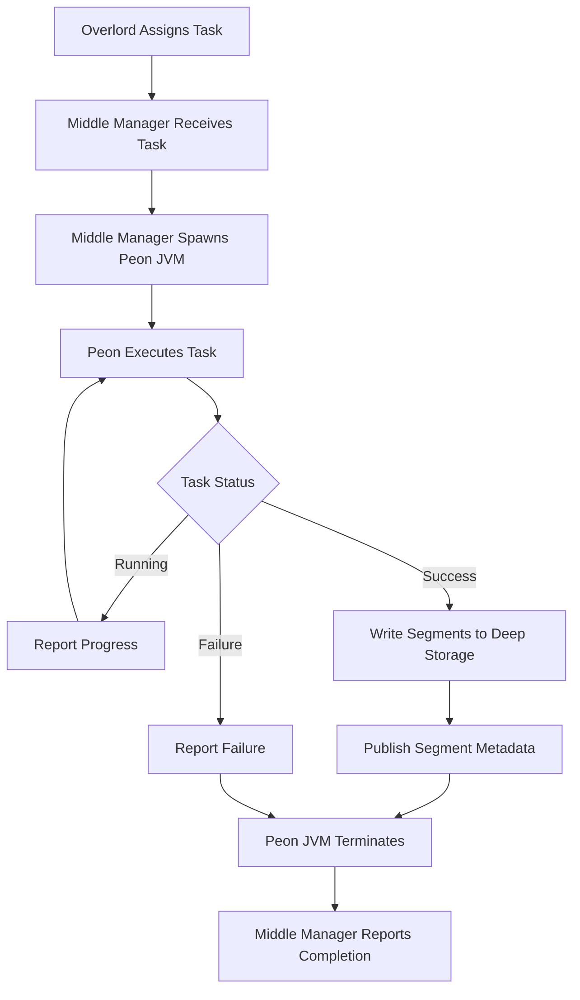

The **Middle Manager service** is a worker service that executes submitted tasks. Middle Managers forward tasks to **Peons** that run in separate JVMs.

## Architecture Overview

<Info>
Druid uses separate JVMs for tasks to isolate resources and logs. Each Peon is capable of running only **one task at a time**, whereas a Middle Manager may have **multiple Peons**.
</Info>

<CardGroup cols={2}>
  <Card title="Resource Isolation" icon="shield">
    Each task runs in its own JVM (Peon), preventing resource contention and failures from affecting other tasks
  </Card>
  <Card title="Log Separation" icon="file-lines">
    Task logs are isolated per Peon, making debugging and monitoring easier
  </Card>
  <Card title="Task Capacity" icon="gauge-high">
    A single Middle Manager can manage multiple Peons, each running one task
  </Card>
  <Card title="Clean Termination" icon="power-off">
    When a task completes, its Peon JVM is terminated, freeing all resources
  </Card>
</CardGroup>

## Key Responsibilities

<Steps>
  <Step title="Receive task assignments">
    Accept task assignments from the Overlord service
  </Step>
  <Step title="Create Peon JVMs">
    Spawn separate JVM processes (Peons) for each task
  </Step>
  <Step title="Monitor task execution">
    Track the progress and status of running tasks
  </Step>
  <Step title="Report task status">
    Communicate task status back to the Overlord
  </Step>
  <Step title="Manage resources">
    Allocate and manage resources (CPU, memory, disk) for Peon processes
  </Step>
</Steps>

## Configuration

For Apache Druid Middle Manager service configuration, see:
- [Middle Manager and Peons Configuration](/configuration/middle-manager-and-peons)
- [Basic cluster tuning](/operations/basic-cluster-tuning#middle-manager)

## Running the Middle Manager

```bash
org.apache.druid.cli.Main server middleManager
```

## HTTP Endpoints

For a list of API endpoints supported by the Middle Manager, see:
- [Service status API reference](/api-reference/service-status-api#middle-manager)

## Middle Manager vs. Peon

Understanding the relationship between Middle Managers and Peons is crucial:

<Tabs>
  <Tab title="Middle Manager">
    **Parent Process**
    
    - Runs as a persistent service
    - Manages multiple Peon JVMs
    - Communicates with the Overlord
    - Allocates resources to Peons
    - Monitors Peon health
    
    <Note>
    The Middle Manager itself doesn't execute tasks—it delegates to Peons.
    </Note>
  </Tab>
  <Tab title="Peon">
    **Child Process**
    
    - Runs as a separate JVM process
    - Executes a single ingestion task
    - Terminates when task completes
    - Isolated resources and logs
    - Reports status to Middle Manager
    
    <Note>
    Each Peon is ephemeral and exists only for the duration of its task.
    </Note>
  </Tab>
</Tabs>

## Task Execution Workflow



## Resource Management

The Middle Manager is responsible for allocating resources to Peon processes:

<CardGroup cols={2}>
  <Card title="Task Slots" icon="hashtag">
    Configure `druid.worker.capacity` to set the maximum number of concurrent Peons (tasks) a Middle Manager can run
  </Card>
  <Card title="Memory Allocation" icon="memory">
    Each Peon gets its own JVM heap, configured via task-specific or global settings
  </Card>
  <Card title="CPU Allocation" icon="microchip">
    Operating system handles CPU scheduling across Peon processes
  </Card>
  <Card title="Disk Space" icon="hard-drive">
    Middle Manager allocates disk space for each Peon's working directory
  </Card>
</CardGroup>

### Example Capacity Planning

<Info>
If you configure a Middle Manager with:
- `druid.worker.capacity = 4`
- 64 GB total RAM
- 16 CPU cores

You might allocate:
- ~12 GB heap per Peon (leaving headroom for OS and Middle Manager)
- ~4 CPU cores per Peon (assuming concurrent execution)
</Info>

## Alternative: Indexer Service

<Warning>
Consider the **Indexer service** as an alternative to Middle Manager + Peon:

- The Indexer runs tasks as **threads within a single JVM** instead of separate processes
- Better resource sharing across tasks
- Easier to configure and deploy
- Still experimental but recommended for certain workloads

See [Indexer Service](/design/indexer) for more details.
</Warning>

## Architecture Integration

<CardGroup cols={2}>
  <Card title="With Overlord" icon="server">
    - Receives task assignments
    - Reports task capacity and availability
    - Sends task status updates and completion notifications
    - Subject to blacklisting if tasks fail repeatedly
  </Card>
  <Card title="With Peons" icon="users">
    - Spawns Peon JVM processes
    - Passes task configuration to Peons
    - Monitors Peon health and resource usage
    - Collects task logs and metrics
  </Card>
  <Card title="With Deep Storage" icon="box-archive">
    - Peons write completed segments to deep storage
    - Middle Manager manages temporary disk space for Peons
  </Card>
  <Card title="With Metadata Store" icon="database">
    - Peons publish segment metadata upon task completion
    - Task status and logs may be persisted
  </Card>
</CardGroup>

## Common Configuration Parameters

<ParamField path="druid.worker.capacity" type="integer" required>
  Maximum number of tasks (Peons) that can run concurrently on this Middle Manager
</ParamField>

<ParamField path="druid.worker.ip" type="string">
  IP address of the Middle Manager. Used for task assignment and communication
</ParamField>

<ParamField path="druid.worker.version" type="string">
  Version identifier for this worker. Can be used for rolling deployments
</ParamField>

<ParamField path="druid.indexer.runner.javaOpts" type="string">
  JVM options to pass to Peon processes. Configure heap size, GC settings, etc.
</ParamField>

<ParamField path="druid.indexer.task.baseTaskDir" type="string">
  Base directory for Peon working directories
</ParamField>

### Example Configuration

```properties
druid.worker.capacity=4
druid.indexer.runner.javaOpts=-Xms3g -Xmx3g -XX:+UseG1GC
druid.indexer.task.baseTaskDir=/mnt/druid/task
druid.worker.ip=10.0.0.100
druid.worker.version=1
```

## Monitoring and Debugging

<Tip>
Best practices for monitoring Middle Managers:

1. **Track task capacity utilization**: Monitor how many task slots are in use
2. **Watch memory usage**: Ensure Peons have enough heap for their workloads
3. **Monitor task duration**: Identify slow or stuck tasks
4. **Check task logs**: Each Peon has separate logs for debugging
5. **Alert on repeated failures**: High failure rates may indicate configuration issues
</Tip>

## Performance Considerations

<Tip>
To optimize Middle Manager performance:

1. **Right-size task capacity**: Don't over-commit resources; leave headroom for OS operations
2. **Use fast local disk**: Task working directories benefit from SSD storage
3. **Tune Peon JVM settings**: Optimize heap size and GC for your workload
4. **Monitor network bandwidth**: Peons download data and upload segments
5. **Consider Indexer service**: For memory-intensive workloads, the Indexer may be more efficient
</Tip>

<Warning>
**Resource Overhead**

Each Peon JVM has overhead:
- JVM startup time
- Heap and metaspace memory
- Thread stacks
- OS file descriptors

Factor this overhead into your capacity planning, especially if running many concurrent tasks.
</Warning>