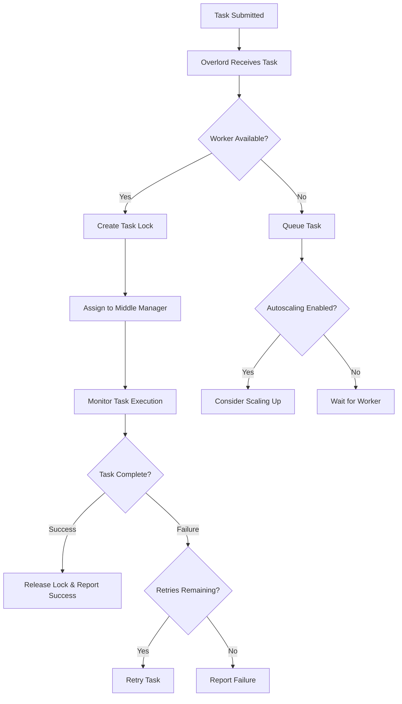

The **Overlord service** is responsible for accepting tasks, coordinating task distribution, creating locks around tasks, and returning statuses to callers. The Overlord can be configured to run in one of two modes: **local** or **remote** (local being default).

## Operating Modes

<Tabs>
  <Tab title="Local Mode">
    In local mode, the Overlord is also responsible for creating Peons for executing tasks. When running the Overlord in local mode, all Middle Manager and Peon configurations must be provided as well.
    
    <Info>
    Local mode is typically used for simple workflows.
    </Info>
  </Tab>
  <Tab title="Remote Mode">
    In remote mode, the Overlord and Middle Manager are run in separate services and you can run each on a different server.
    
    <Tip>
    This mode is recommended if you intend to use the indexing service as the single endpoint for all Druid indexing.
    </Tip>
  </Tab>
</Tabs>

## Key Responsibilities

<CardGroup cols={2}>
  <Card title="Task Acceptance" icon="inbox">
    Receives and validates incoming indexing tasks
  </Card>
  <Card title="Task Distribution" icon="network-wired">
    Coordinates distribution of tasks to Middle Managers or Peons
  </Card>
  <Card title="Lock Management" icon="lock">
    Creates and manages locks around tasks to prevent conflicts
  </Card>
  <Card title="Status Reporting" icon="chart-line">
    Returns task statuses and progress to callers
  </Card>
  <Card title="Worker Blacklisting" icon="ban">
    Monitors task failures and blacklists problematic workers
  </Card>
  <Card title="Autoscaling" icon="arrows-up-down">
    Automatically scales Middle Manager capacity based on task load
  </Card>
</CardGroup>

## Configuration

For Apache Druid Overlord service configuration, see:
- [Overlord Configuration](/configuration/overlord)
- [Basic cluster tuning](/operations/basic-cluster-tuning#overlord)

## Running the Overlord

```bash
org.apache.druid.cli.Main server overlord
```

## HTTP Endpoints

For a list of API endpoints supported by the Overlord, see:
- [Service status API reference](/api-reference/service-status-api#overlord)

## Blacklisted Workers

If a Middle Manager has task failures above a threshold, the Overlord will blacklist these Middle Managers. This prevents problematic workers from receiving new tasks while they're experiencing issues.

### Blacklisting Behavior

<Steps>
  <Step title="Monitor task failures">
    The Overlord tracks task failures per Middle Manager against the configured threshold.
  </Step>
  <Step title="Blacklist problematic workers">
    When a Middle Manager exceeds the failure threshold, it is added to the blacklist.
  </Step>
  <Step title="Respect blacklist limits">
    No more than 20% of the Middle Managers can be blacklisted at any given time.
  </Step>
  <Step title="Periodic whitelisting">
    Blacklisted Middle Managers will be periodically whitelisted to allow recovery.
  </Step>
</Steps>

### Configuration Variables

The following variables can be used to set the threshold and blacklist timeouts:

<ParamField path="druid.indexer.runner.maxRetriesBeforeBlacklist" type="integer">
  Maximum number of task failures before a worker is blacklisted
</ParamField>

<ParamField path="druid.indexer.runner.workerBlackListBackoffTime" type="duration">
  Time period a worker remains blacklisted before being reconsidered
</ParamField>

<ParamField path="druid.indexer.runner.workerBlackListCleanupPeriod" type="duration">
  How often the Overlord checks for workers that can be removed from the blacklist
</ParamField>

<ParamField path="druid.indexer.runner.maxPercentageBlacklistWorkers" type="float">
  Maximum percentage of workers that can be blacklisted (default: 0.2 or 20%)
</ParamField>

### Example Configuration

```properties
druid.indexer.runner.maxRetriesBeforeBlacklist=5
druid.indexer.runner.workerBlackListBackoffTime=PT15M
druid.indexer.runner.workerBlackListCleanupPeriod=PT5M
druid.indexer.runner.maxPercentageBlacklistWorkers=0.2
```

<Warning>
Blacklisting is a protective mechanism. If too many workers are failing, it may indicate a broader issue with your cluster configuration or data rather than individual worker problems.
</Warning>

## Autoscaling

<Note>
The autoscaling mechanisms currently in place are tightly coupled with specific deployment infrastructure but the framework should be in place for other implementations. The Druid community is highly open to new implementations or extensions of the existing mechanisms.
</Note>

If autoscaling is enabled, the Overlord can automatically adjust the number of Middle Managers based on task load:

<Tabs>
  <Tab title="Scale Up">
    New Middle Managers may be added when a task has been in pending state for too long.
    
    <Info>
    This ensures that task queues don't grow indefinitely during periods of high ingestion load.
    </Info>
  </Tab>
  <Tab title="Scale Down">
    Middle Managers may be terminated if they have not run any tasks for a period of time.
    
    <Info>
    This helps reduce costs during periods of low ingestion activity.
    </Info>
  </Tab>
</Tabs>

### Deployment-Specific Autoscaling

In some deployments, Middle Manager services are provisioned as cloud instances (e.g., Amazon AWS EC2 nodes) and they are provisioned to register themselves in a deployment environment like [Galaxy](https://github.com/ning/galaxy).

<Tip>
When implementing autoscaling for your deployment:

1. Monitor task queue depths
2. Set appropriate scale-up thresholds to handle spikes
3. Set conservative scale-down thresholds to avoid thrashing
4. Test scaling behavior under load
5. Consider cost vs. performance tradeoffs
</Tip>

## Task Distribution Workflow

Here's how the Overlord distributes tasks to workers:



## Architecture Integration

<CardGroup cols={2}>
  <Card title="With Middle Managers" icon="server">
    - Assigns tasks to available Middle Managers
    - Monitors task execution and progress
    - Tracks worker health and blacklists problematic workers
    - Manages autoscaling of worker capacity
  </Card>
  <Card title="With Metadata Store" icon="database">
    - Stores task metadata and status
    - Maintains task lock information
    - Persists task history and audit logs
  </Card>
  <Card title="With Clients" icon="users">
    - Receives task submission requests
    - Returns task IDs and status information
    - Provides APIs for task management
  </Card>
  <Card title="With ZooKeeper" icon="sitemap">
    - Coordinates distributed locking
    - Manages leader election for high availability
    - Publishes worker availability information
  </Card>
</CardGroup>

## High Availability

<Info>
The Overlord supports high availability through leader election. You can run multiple Overlord instances, and they will coordinate through ZooKeeper to ensure only one is active at a time. If the active Overlord fails, another will automatically take over.
</Info>

## Performance Considerations

<Tip>
To optimize Overlord performance:

1. **Size appropriately**: The Overlord is typically lightweight but needs enough memory for task metadata
2. **Monitor task queues**: High queue depths may indicate insufficient worker capacity
3. **Tune blacklisting parameters**: Balance between giving workers chances to recover and protecting against bad workers
4. **Configure autoscaling**: Set thresholds that match your workload patterns
5. **Use remote mode for production**: Separating Overlord and Middle Managers provides better isolation and scalability
</Tip>